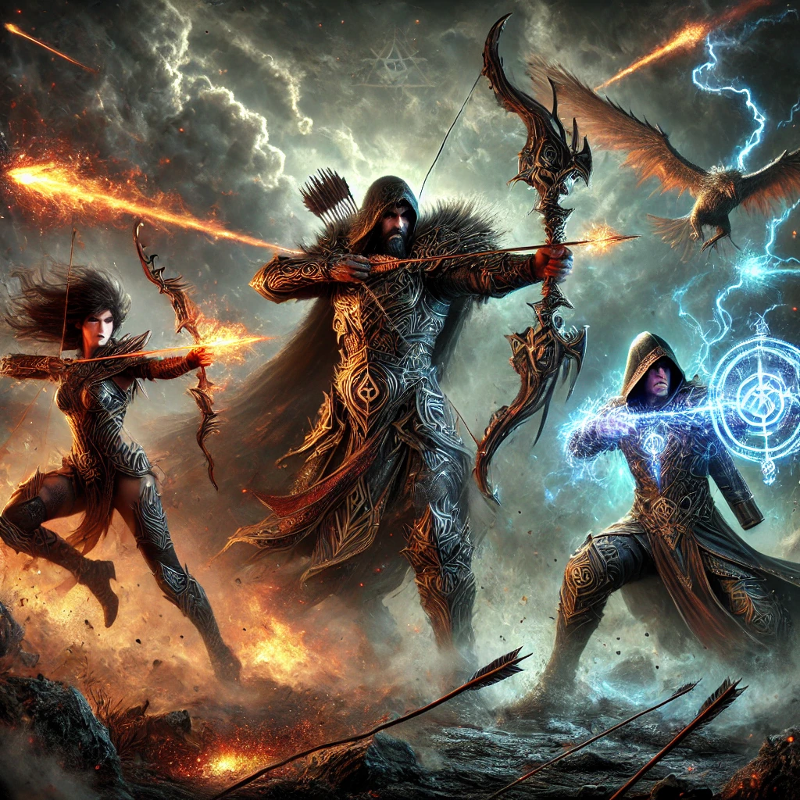

# Ring Battle: The NFC Showdown in Middle-earth



## One App to Rule Them All

Welcome to Ring Battle, where the ancient art of ring-forging meets modern NFC technology! In this epic showdown, warriors from all corners of Middle-earth gather to battle with their NFC-enabled rings, each imbued with unique powers and ancient wisdom.

## Features

- **Scan Rings**: Discover the hidden powers within each NFC ring.
- **Write Spells**: Inscribe new enchantments onto your rings.
- **Battle Arena**: (Coming Soon) Engage in magical duels with other ring-bearers.

## Getting Started

To join the battle:

1. Clone this repository of ancient knowledge:
   ```
   git clone https://github.com/your-username/ring-battle.git
   ```
2. Open the tome (project) in Xcode.
3. Ensure you possess a device with NFC capabilities (iPhone 7 or later).
4. Run the app and prepare for battle!

## Requirements

- iOS 17.6+
- Xcode 15.0+
- An NFC-enabled iPhone (iPhone 7 or later)
- A heart full of courage and a mind sharp as Elven-steel

## Usage

1. **To Read a Ring's Power**:
   - Tap "Scan NFC Ring"
   - Hold your iPhone near the NFC ring
   - Witness the ring's power reveal itself

2. **To Inscribe New Spells**:
   - Enter your incantation in the text field
   - Tap "Write to NFC Ring"
   - Hold your iPhone near the NFC ring
   - Feel the ancient magic flow through your device

## Contributing

Join our fellowship! If you wish to contribute:

1. Fork the repository
2. Create your feature branch (`git checkout -b feature/AmazingFeature`)
3. Commit your changes (`git commit -m 'Add some AmazingFeature'`)
4. Push to the branch (`git push origin feature/AmazingFeature`)
5. Open a Pull Request

## License

Distributed under the MIT License. See `LICENSE` file for more information.

## Contact

Your Name - [@your_twitter](https://twitter.com/your_twitter) - email@example.com

Project Link: [https://github.com/your-username/ring-battle](https://github.com/your-username/ring-battle)

## Acknowledgements

- [Swift](https://swift.org/)
- [Core NFC](https://developer.apple.com/documentation/corenfc)
- [SwiftUI](https://developer.apple.com/xcode/swiftui/)
- [J.R.R. Tolkien](https://www.tolkienestate.com/) for the inspiration

---

MIT License

Copyright (c) [year] [fullname]

Permission is hereby granted, free of charge, to any person obtaining a copy
of this software and associated documentation files (the "Software"), to deal
in the Software without restriction, including without limitation the rights
to use, copy, modify, merge, publish, distribute, sublicense, and/or sell
copies of the Software, and to permit persons to whom the Software is
furnished to do so, subject to the following conditions:

The above copyright notice and this permission notice shall be included in all
copies or substantial portions of the Software.

THE SOFTWARE IS PROVIDED "AS IS", WITHOUT WARRANTY OF ANY KIND, EXPRESS OR
IMPLIED, INCLUDING BUT NOT LIMITED TO THE WARRANTIES OF MERCHANTABILITY,
FITNESS FOR A PARTICULAR PURPOSE AND NONINFRINGEMENT. IN NO EVENT SHALL THE
AUTHORS OR COPYRIGHT HOLDERS BE LIABLE FOR ANY CLAIM, DAMAGES OR OTHER
LIABILITY, WHETHER IN AN ACTION OF CONTRACT, TORT OR OTHERWISE, ARISING FROM,
OUT OF OR IN CONNECTION WITH THE SOFTWARE OR THE USE OR OTHER DEALINGS IN THE
SOFTWARE.
