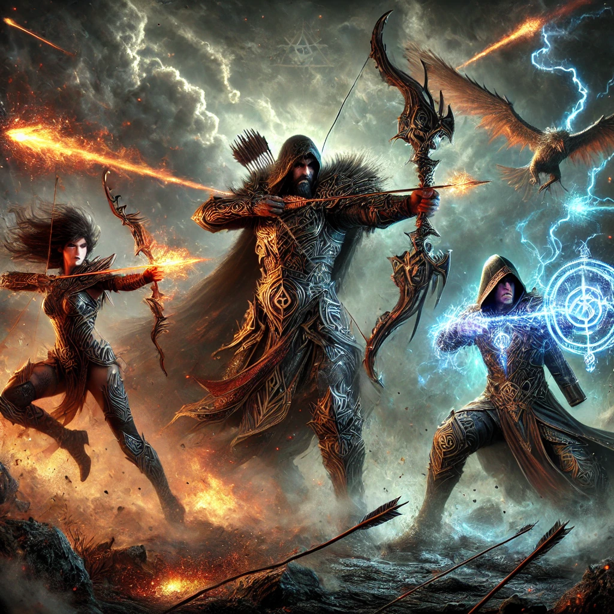

# Ring Battle: The NFC Showdown in Middle-earth



## One App to Rule Them All

Welcome to Ring Battle, where the ancient art of ring-forging meets modern NFC technology! In this epic showdown, warriors from all corners of Middle-earth gather to battle with their NFC-enabled rings, each imbued with unique powers and ancient wisdom.

## Features

1. **Character Selection Carousel**
   - Implemented using SwiftUI's GeometryReader and custom animations
   - Allows users to swipe through character options (Archer, Warrior, Mage)
   - Provides a smooth, infinite scrolling effect

2. **NFC Integration**
   - Utilizes CoreNFC framework for reading from and writing to NFC tags
   - Implements NDEF (NFC Data Exchange Format) for data storage
   - Supports both reading and writing operations

3. **Battle Squad Formation**
   - Users can select a character and write it to an NFC ring
   - Implements error handling for NFC operations

4. **Duel Mode**
   - Players can scan their NFC rings to enter their characters into a duel
   - Implements a rock-paper-scissors style battle system:
     - Mage beats Warrior
     - Warrior beats Archer
     - Archer beats Mage

5. **Custom UI**
   - Dark fantasy theme with custom button and text field styles
   - Responsive layout adapting to different iOS devices

6. **Battle Arena** (Coming Soon)
   - Engage in magical duels with other ring-bearers online

## Technical Details

### NFC Implementation

The app uses the `NFCNDEFReaderSession` class to interact with NFC tags. Key aspects include:

- **Reading**: 
  - Detects NDEF messages on NFC tags
  - Parses text records (type "T") and URI records
  - Handles different NFC tag statuses (read-only, read-write)

- **Writing**:
  - Creates NDEF text records with "en" language code
  - Writes character data to NFC tags

- **Error Handling**:
  - Manages various NFC-related errors (e.g., tag not found, read/write errors)
  - Provides user-friendly error messages

### UI Components

- **CharacterCarousel**: A custom SwiftUI view that creates an infinite scrolling effect for character selection
- **CustomDarkFantasyButtonStyle**: A custom button style conforming to SwiftUI's `ButtonStyle` protocol
- **CustomDarkFantasyTextFieldStyle**: A custom text field style for theme consistency

### State Management

- Uses `@State` and `@Binding` for local view state management
- Implements `@StateObject` for the NFCReader to maintain its lifecycle throughout the app

## Requirements

- iOS 17.6+
- Xcode 15.0+
- Swift 5.3+
- An NFC-enabled iPhone (iPhone 7 or later)
- A heart full of courage and a mind sharp as Elven-steel

## Installation

1. Clone the repository of ancient knowledge:
   ```
   git clone https://github.com/your-username/ring-battle.git
   ```
2. Open the tome (project) in Xcode
3. Build and run on a physical device with NFC capabilities

Note: The app requires a physical device for NFC functionality and cannot be fully tested in the simulator.

## Usage

1. **To Read a Ring's Power**:
   - Tap "Scan NFC Ring"
   - Hold your iPhone near the NFC ring
   - Witness the ring's power reveal itself

2. **To Inscribe New Spells**:
   - Enter your incantation in the text field
   - Tap "Write to NFC Ring"
   - Hold your iPhone near the NFC ring
   - Feel the ancient magic flow through your device

## Contributing

Join our fellowship! If you wish to contribute:

1. Fork the repository
2. Create your feature branch (`git checkout -b feature/AmazingFeature`)
3. Commit your changes (`git commit -m 'Add some AmazingFeature'`)
4. Push to the branch (`git push origin feature/AmazingFeature`)
5. Open a Pull Request

## License

Distributed under the MIT License. See `LICENSE` file for more information.

## Contact

Your Name - [@your_twitter](https://twitter.com/your_twitter) - email@example.com

Project Link: [https://github.com/your-username/ring-battle](https://github.com/your-username/ring-battle)

## Acknowledgements

- [Ring of Rings](https://github.com/RingOfRings/RingOfRingsSDK)
- [Core NFC](https://developer.apple.com/documentation/corenfc)
- [J.R.R. Tolkien](https://www.tolkienestate.com/) for the inspiration